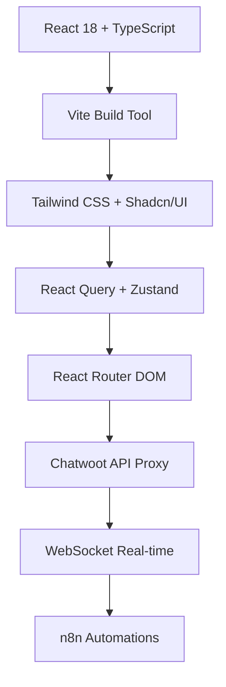

# ChatHook - Sistema de Gestão de Conversas

<div align="center">


**Sistema moderno de gestão de conversas integrado com API Chatwoot**

[](https://www.typescriptlang.org/)
[](https://reactjs.org/)
[](https://vitejs.dev/)
[](https://tailwindcss.com/)
[](https://opensource.org/licenses/MIT)

[Demo](https://chathook.com.br) • [Documentação](https://docs.chathook.com.br) • [API](https://api.chathook.com.br)

</div>

## 📋 Índice

- [🚀 Sobre o Projeto](#-sobre-o-projeto)
- [✨ Funcionalidades](#-funcionalidades)
- [🏗️ Arquitetura](#️-arquitetura)
- [📦 Instalação](#-instalação)
- [⚙️ Configuração](#️-configuração)
- [🔧 Desenvolvimento](#-desenvolvimento)
- [🧪 Testes](#-testes)
- [📈 Deploy](#-deploy)
- [🔗 API Integration](#-api-integration)
- [🎨 Customização](#-customização)
- [📚 Documentação](#-documentação)
- [🤝 Contribuição](#-contribuição)
- [📝 Licença](#-licença)

## 🚀 Sobre o Projeto

O **ChatHook** é uma solução moderna e escalável para gestão de conversas e atendimento ao cliente, desenvolvido com tecnologias de ponta e integrado com a API do Chatwoot. 

### 🎯 Objetivo

Fornecer uma interface intuitiva e performática para gerenciar conversas de múltiplos canais (WhatsApp, Email, etc.) com foco na experiência do usuário e produtividade dos agentes.

### 🌟 Diferenciais

- **Performance**: Construído com Vite + React 18 para máxima velocidade
- **UI Moderna**: Interface baseada em Shadcn/UI e Tailwind CSS
- **Tempo Real**: WebSockets para atualizações instantâneas
- **Multiempresa**: Isolamento completo de dados por account_id
- **Extensível**: Arquitetura preparada para integrações futuras
- **Acessível**: Totalmente acessível e responsivo

## ✨ Funcionalidades

### 📱 Gestão de Conversas
- [x] Lista de conversas com filtros avançados
- [x] Visualização em tempo real de mensagens
- [x] Suporte a múltiplos tipos de mídia
- [x] Indicadores de status e leitura
- [x] Busca global por conversas e contatos
- [x] Atribuição automática e manual de agentes

### 👥 Gerenciamento de Contatos
- [x] Perfis completos de contatos
- [x] Histórico de interações
- [x] Tags e categorização
- [x] Notas e anotações
- [x] Status de disponibilidade

### 📊 Dashboard e Analytics
- [x] Métricas em tempo real
- [x] Relatórios de performance
- [x] Estatísticas de atendimento
- [x] Indicadores de SLA
- [x] Gráficos interativos

### 🔔 Notificações e Alertas
- [x] Notificações desktop
- [x] Alertas sonoros
- [x] Indicadores visuais
- [x] Configurações personalizáveis

### ⚡ Automações
- [x] Respostas automáticas
- [x] Regras de atribuição
- [x] Webhooks para integrações
- [x] Fluxos personalizados via n8n

## 🏗️ Arquitetura

### 📊 Stack Tecnológico



### 🔧 Principais Dependências

| Categoria | Tecnologia | Versão | Propósito |
|-----------|------------|--------|-----------|
| **Core** | React | ^18.3 | UI Framework |
| **Build** | Vite | ^5.3 | Build Tool & Dev Server |
| **Language** | TypeScript | ^5.5 | Type Safety |
| **Styling** | Tailwind CSS | ^3.4 | Utility-first CSS |
| **UI Components** | Shadcn/UI | Latest | Component Library |
| **State** | Zustand | ^4.5 | Global State Management |
| **Data** | React Query | ^5.51 | Server State Management |
| **Routing** | React Router | ^6.26 | Client-side Routing |
| **Icons** | Lucide React | ^0.427 | Icon Library |
| **Dates** | date-fns | ^3.6 | Date Utilities |

### 📁 Estrutura do Projeto

```
src/
├── components/          # Componentes reutilizáveis
│   ├── ui/             # Componentes base (Shadcn/UI)
│   ├── layout/         # Layout components
│   ├── conversations/  # Componentes de conversas
│   └── settings/       # Componentes de configuração
├── hooks/              # Custom hooks
├── services/           # Camada de API e serviços
├── store/              # Estado global (Zustand)
├── types/              # Definições TypeScript
├── config/             # Configurações e constantes
├── lib/                # Utilitários e helpers
├── pages/              # Páginas principais
└── test/               # Configuração de testes
```

## 📦 Instalação

### 📋 Pré-requisitos

- **Node.js** 18.0+ 
- **npm** 8.0+ ou **yarn** 1.22+
- **Git** para versionamento

### 🔧 Instalação Local

1. **Clone o repositório:**
```bash
git clone https://github.com/chathook/chathook-app.git
cd chathook-app
```

2. **Instale as dependências:**
```bash
npm install
# ou
yarn install
```

3. **Configure as variáveis de ambiente:**
```bash
cp .env.example .env
```

4. **Configure seu arquivo `.env`:**
```env
# API Configuration
VITE_API_BASE_URL=https://api.chathook.com.br/api/chatwoot-proxy.php
VITE_WS_URL=wss://api.chathook.com.br/cable

# App Configuration  
VITE_APP_NAME=ChatHook
VITE_APP_VERSION=1.0.0

# Features
VITE_ENABLE_WEBSOCKET=true
VITE_ENABLE_NOTIFICATIONS=true
```

5. **Inicie o servidor de desenvolvimento:**
```bash
npm run dev
# ou
yarn dev
```

6. **Acesse a aplicação:**
```
http://localhost:3000
```

## ⚙️ Configuração

### 🔑 Configuração da API

1. **Acesse as configurações** em `/settings`
2. **Insira suas credenciais:**
   - **Account ID**: Seu ID de conta no Chatwoot
   - **Token de Acesso**: Token gerado no painel do Chatwoot
3. **Teste a conexão** clicando em "Testar Conexão"
4. **Configure permissões** conforme necessário

### 🌐 URLs Oficiais

- **Produção**: https://chathook.com.br
- **API Proxy**: https://api.chathook.com.br/api/chatwoot-proxy.php
- **Chatwoot Demo**: https://chat.chathook.com.br
- **Documentação**: https://docs.chathook.com.br

### 🔒 Configuração de Segurança

```typescript
// Exemplo de configuração de autenticação
import { chatwootAPI } from '@/services/api';

// Configurar credenciais
chatwootAPI.setAuth(token, accountId);

// Verificar autenticação
if (chatwootAPI.isAuthenticated()) {
  // Usuário autenticado
}
```

## 🔧 Desenvolvimento

### 🛠️ Scripts Disponíveis

```bash
# Desenvolvimento
npm run dev                 # Servidor de desenvolvimento
npm run preview            # Preview da build de produção

# Build
npm run build              # Build para produção
npm run type-check         # Verificação de tipos TypeScript

# Qualidade de Código
npm run lint               # Executar ESLint
npm run lint:fix           # Corrigir problemas automaticamente
npm run format             # Formatar código com Prettier
npm run format:check       # Verificar formatação

# Testes
npm run test               # Executar testes
npm run test:ui            # Interface de testes
npm run test:coverage      # Coverage dos testes

# Storybook
npm run storybook          # Servidor do Storybook
npm run build-storybook    # Build do Storybook
```

### 🎨 Desenvolvendo Componentes

```typescript
// Exemplo de componente seguindo os padrões do projeto
import { cn } from '@/lib/utils';
import { Button } from '@/components/ui/button';

interface MyComponentProps {
  title: string;
  variant?: 'default' | 'outlined';
  className?: string;
}

export function MyComponent({ 
  title, 
  variant = 'default', 
  className 
}: MyComponentProps) {
  return (
    <div className={cn('p-4 rounded-lg', className)}>
      <h2 className="text-lg font-semibold">{title}</h2>
      <Button variant={variant}>Ação</Button>
    </div>
  );
}
```

### 🔄 Estado Global

```typescript
// Usando Zustand para estado global
import { useAppStore } from '@/store/useAppStore';

function MyComponent() {
  const { 
    selectedConversationId, 
    setSelectedConversation 
  } = useAppStore();

  const handleSelect = (id: number) => {
    setSelectedConversation(id);
  };

  return (
    // JSX do componente
  );
}
```

### 📡 Integrando com a API

```typescript
// Usando hooks personalizados para API
import { useConversations, useSendMessage } from '@/hooks/useChatwoot';

function ConversationComponent() {
  const { data: conversations, isLoading } = useConversations();
  const sendMessage = useSendMessage();

  const handleSend = async (content: string) => {
    await sendMessage.mutateAsync({
      conversationId: 123,
      content
    });
  };

  if (isLoading) return <div>Carregando...</div>;

  return (
    // JSX do componente
  );
}
```

## 🧪 Testes

### 🔬 Configuração de Testes

O projeto usa **Vitest** para testes unitários e de integração:

```bash
# Executar todos os testes
npm run test

# Modo watch
npm run test:watch

# Interface gráfica
npm run test:ui

# Coverage
npm run test:coverage
```

### 📝 Exemplo de Teste

```typescript
// src/components/__tests__/Button.test.tsx
import { render, screen, fireEvent } from '@testing-library/react';
import { Button } from '@/components/ui/button';

describe('Button', () => {
  test('renders correctly', () => {
    render(<Button>Click me</Button>);
    expect(screen.getByRole('button')).toBeInTheDocument();
  });

  test('handles click events', () => {
    const handleClick = vi.fn();
    render(<Button onClick={handleClick}>Click me</Button>);
    
    fireEvent.click(screen.getByRole('button'));
    expect(handleClick).toHaveBeenCalledTimes(1);
  });
});
```

## 📈 Deploy

### 🚀 Deploy para Produção

1. **Build da aplicação:**
```bash
npm run build
```

2. **Deploy estático (Vercel/Netlify):**
```bash
# Vercel
npx vercel --prod

# Netlify
npm run build && netlify deploy --prod --dir=dist
```

3. **Deploy com Docker:**
```dockerfile
FROM node:18-alpine AS builder
WORKDIR /app
COPY package*.json ./
RUN npm ci --only=production

COPY . .
RUN npm run build

FROM nginx:alpine
COPY --from=builder /app/dist /usr/share/nginx/html
COPY nginx.conf /etc/nginx/nginx.conf
EXPOSE 80
CMD ["nginx", "-g", "daemon off;"]
```

### 🌐 Configuração de Produção

```bash
# Variáveis de ambiente para produção
VITE_API_BASE_URL=https://api.chathook.com.br/api/chatwoot-proxy.php
VITE_WS_URL=wss://api.chathook.com.br/cable
VITE_APP_NAME=ChatHook
VITE_ENABLE_ANALYTICS=true
VITE_SENTRY_DSN=your_sentry_dsn
```

## 🔗 API Integration

### 📊 Endpoints Principais

A integração é feita através do proxy da API do Chatwoot:

```typescript
// Conversas
GET /accounts/{accountId}/conversations
GET /accounts/{accountId}/conversations/{id}
PATCH /accounts/{accountId}/conversations/{id}

// Mensagens  
GET /accounts/{accountId}/conversations/{id}/messages
POST /accounts/{accountId}/conversations/{id}/messages

// Contatos
GET /accounts/{accountId}/contacts
GET /accounts/{accountId}/contacts/{id}
PATCH /accounts/{accountId}/contacts/{id}
```

### 🔄 WebSocket Events

```typescript
// Eventos em tempo real
{
  "type": "conversation.updated",
  "id": 123,
  "data": { /* conversation data */ }
}

{
  "type": "message.created", 
  "conversation_id": 123,
  "data": { /* message data */ }
}

{
  "type": "conversation.typing_on",
  "conversation_id": 123,
  "user": "John Doe"
}
```

### 📄 Exemplo de Resposta

```json
{
  "data": {
    "meta": {
      "mine_count": 5,
      "assigned_count": 12,
      "unassigned_count": 8,
      "all_count": 25
    },
    "payload": [
      {
        "id": 123,
        "uuid": "abc-def-ghi",
        "status": "open",
        "unread_count": 2,
        "meta": {
          "sender": {
            "id": 456,
            "name": "João Silva",
            "phone_number": "+5511999999999"
          }
        },
        "messages": [
          {
            "id": 789,
            "content": "Olá, preciso de ajuda",
            "sender_type": "Contact",
            "created_at": 1635724800
          }
        ]
      }
    ]
  }
}
```

## 🎨 Customização

### 🎭 Temas

O projeto suporta temas claro e escuro:

```css
/* src/index.css */
:root {
  --background: 0 0% 100%;
  --foreground: 222.2 84% 4.9%;
  --primary: 221.2 83.2% 53.3%;
  /* ... */
}

.dark {
  --background: 222.2 84% 4.9%;
  --foreground: 210 40% 98%;
  --primary: 217.2 91.2% 59.8%;
  /* ... */
}
```

### 🎨 Personalizando Cores

```typescript
// tailwind.config.js
module.exports = {
  theme: {
    extend: {
      colors: {
        primary: {
          50: '#eff6ff',
          500: '#3b82f6', 
          900: '#1e3a8a',
        },
        // Adicione suas cores customizadas
      }
    }
  }
}
```

### 🧩 Componentes Customizados

```typescript
// Estendendo componentes base
import { Button } from '@/components/ui/button';
import { cn } from '@/lib/utils';

const CustomButton = ({ className, ...props }) => {
  return (
    <Button 
      className={cn('bg-gradient-to-r from-blue-500 to-purple-600', className)}
      {...props}
    />
  );
};
```

## 📚 Documentação

### 📖 Recursos Adicionais

- [Guia de Contribuição](CONTRIBUTING.md)
- [Changelog](CHANGELOG.md)
- [Roadmap](ROADMAP.md)
- [FAQ](docs/FAQ.md)
- [API Reference](docs/API.md)
- [Component Documentation](docs/COMPONENTS.md)

### 🎓 Tutoriais

- [Como criar um novo componente](docs/tutorials/creating-components.md)
- [Integrando com APIs externas](docs/tutorials/api-integration.md)
- [Configurando automações](docs/tutorials/automation-setup.md)
- [Deploy em produção](docs/tutorials/production-deployment.md)

## 🤝 Contribuição

Contribuições são sempre bem-vindas! Veja como participar:

1. **Fork** o projeto
2. **Crie** uma branch para sua feature (`git checkout -b feature/AmazingFeature`)
3. **Commit** suas mudanças (`git commit -m 'Add some AmazingFeature'`)
4. **Push** para a branch (`git push origin feature/AmazingFeature`)
5. **Abra** um Pull Request

### 📋 Guidelines

- Siga os padrões de código estabelecidos
- Escreva testes para novas funcionalidades
- Mantenha a documentação atualizada
- Use commits semânticos (conventional commits)

### 🐛 Reportando Bugs

Abra uma [issue](https://github.com/chathook/chathook-app/issues) com:

- Descrição clara do problema
- Passos para reproduzir
- Comportamento esperado vs atual
- Screenshots/vídeos se aplicável
- Informações do ambiente

## 📝 Licença

Este projeto está licenciado sob a Licença MIT - veja o arquivo [LICENSE](LICENSE) para detalhes.

---

<div align="center">

**Feito com ❤️ pela equipe ChatHook**

[Website](https://chathook.com.br) • [GitHub](https://github.com/chathook) • [Documentação](https://docs.chathook.com.br) • [Suporte](mailto:support@chathook.com.br)

</div>
